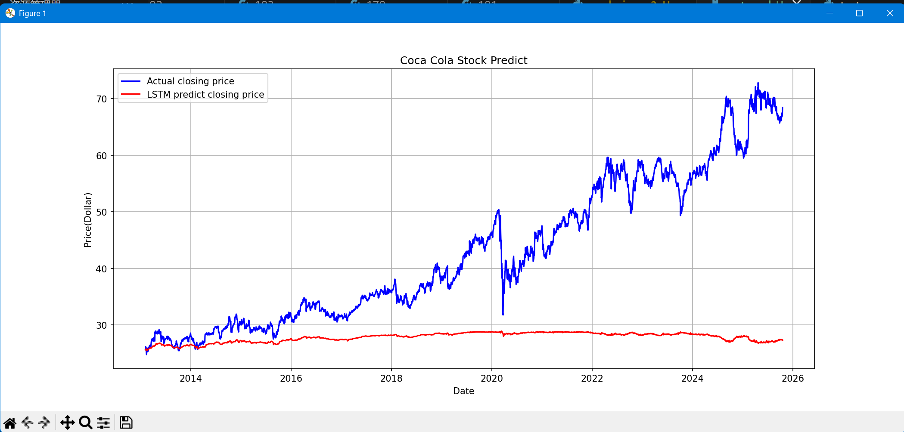

# Coca Cola Stock Analysis
## 1.项目分析
要实现股票价格的预测，考虑使用深度学习模型。

深度学习模型的适用性： 股票价格预测本质上是一个时间序列预测问题。

循环神经网络 (RNN) 及其变体，如 长短期记忆网络 (LSTM) 和 门控循环单元 (GRU)，是处理序列数据的标准选择，因为它们能够捕捉时间序列中的长期依赖关系。

一维卷积神经网络 (1D-CNN) 也可以用于特征提取，或者与 LSTM/GRU 结合使用。

预测目标： 可以预测未来的收盘价、开盘价、最高价、最低价或简单的每日收益率。

预测限制：预测应该是短期的，因为股价可能受突发新闻影响，从而导致真实值与预测值的差值，即残差较大。

我希望使用PyTorch，但是Gemini告诉我用Tensorflow更加简单，于是决定先做一个简单模型实现。
## 2.简易版模型
训练集：全部数据的前80%
测试集：全部数据的后80%
训练效果预估：因为没有限制短时间，长期来看股价趋向于常函数，并且2010年有很多突发新闻，这些简易模型是无法获取的，也无法预测。

真实效果：

效果分析：和预期的一样，模型预期的曲线甚至可以用常函数拟合了，这样的预测是没有效果的。
## 3.